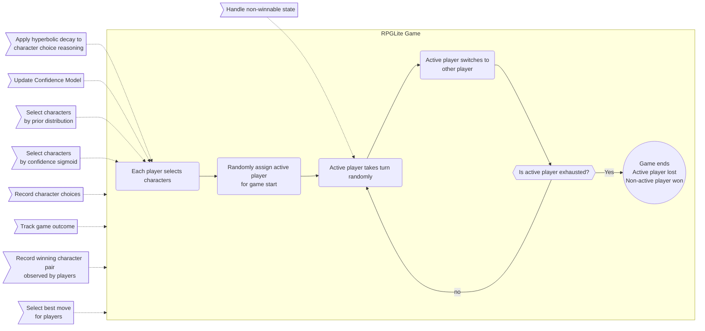

```mermaid
flowchart LR
    %% Aspects to apply
    hyperbolicDecay>Apply hyperbolic decay to\ncharacter choice reasoning]
    updateConfidenceModel>Update Confidence Model]
    %% recordPrior>Record prior distribution\nof character preferences] TODO TODO seems like this hooks onto generating data…?!?!
    chooseBasedOnPrior>Select characters\nby prior distribution]
    chooseBasedOnConfidence>Select characters\nby confidence sigmoid]
    recordChoices>Record character choices]
    trackGameOutcome>Track game outcome]
    recordWinningPair>Record winning character pair\nobserved by players]
    ensureBestMove>Select best move\nfor players]
    cannotWin>Handle non-winnable state]
    
    
    %% Gameplay steps
    pickChars(Each player selects characters)
    assignFirst(Randomly assign active player\nfor game start)
    takeTurn(Active player takes turn randomly)
    swapActive(Active player switches to\nother player)
    gameEndedCheck{{Is active player exhausted?}}
    gameEnd((Game ends\nActive player lost\nNon-active player won))

    %% Aspects to apply
    hyperbolicDecay -.->pickChars
    updateConfidenceModel -.-> pickChars
    %% recordPrior -.->  TODO TODO seems like this hooks onto generating data…?!?!
    chooseBasedOnPrior -.-> pickChars
    chooseBasedOnConfidence -.-> pickChars
    recordChoices -.-> gameplay
    trackGameOutcome -.-> gameplay
    recordWinningPair -.-> gameplay
    ensureBestMove -.-> gameplay

    cannotWin -.-> takeTurn

    %% Gameplay graph
    subgraph gameplay [RPGLite Game]
        pickChars --> assignFirst --> takeTurn --> swapActive --> gameEndedCheck -- Yes --> gameEnd
        gameEndedCheck -- no --> takeTurn
    end

    
```